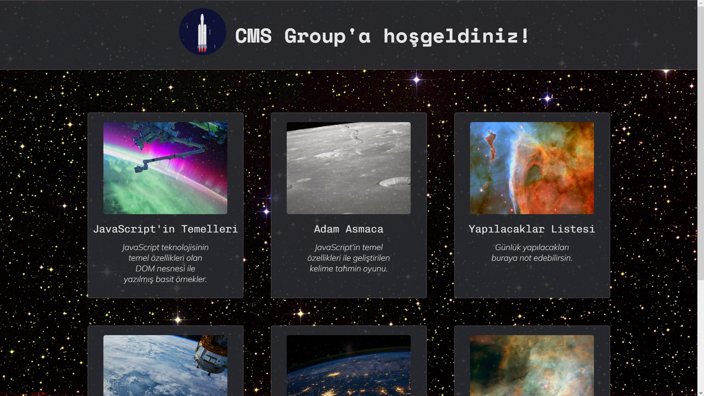

<h1 align="center">https://ymg-project.netlify.app</h1>

## Table of Contents
- [Overview](#overview)
- [Use Case](#use-case)
- [Built With](#built-with)
- [Features](#features)
- [Acknowledgements](#acknowledgements)
- [Extracted parts](#contact)
- [Contact](#contact)

## Overview

## Use Case

## Built With
- [HTML](https://www.w3schools.com/html/default.asp)
- [CSS](https://www.w3schools.com/css/default.asp)
- [JavaScript](https://developer.mozilla.org/en-US/docs/Web/JavaScript)

## Features
The web page includes apps that contain weather rapor, quiz app, document for who want to start learn the web tech, ready-to-use responsive designs, to-do list and mini games. This app created as a YMG's project.

## Acknowledgements
<!-- This section should list any articles or add-ons/plugins that helps you to complete the project. This is optional but it will help you in the future. For exmpale -->
- [MDN - JavaScript](https://developer.mozilla.org/en-US/docs/Learn/JavaScript)
- [W3 - JavaScript](https://www.w3schools.com/js/js_htmldom.asp)
- [To fix problems](https://stackoverflow.com)

## Extracted parts
> The weather app has been extracted due to the discontinuation of the API support.

## Contact
- Linkedin [Cansın](https://www.linkedin.com/in/cansın-lale-64a098130/)
- Linkedin [Sahil](https://www.linkedin.com/in/sahil-baylarli-a81a281ab/)
- Linkedin [Mete](https://www.linkedin.com/in/metehan-akbulut-323003272/)
