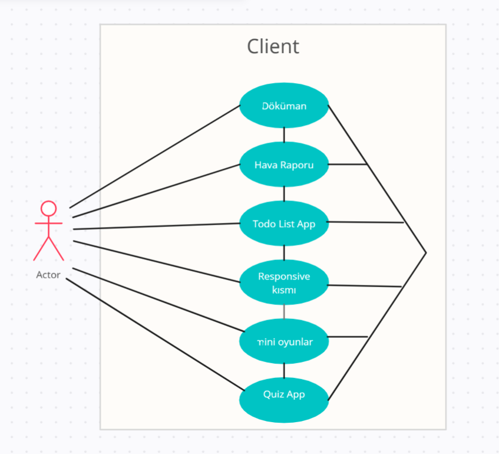

<h1 align="center">client-link</h1>

## Table of Contents
- [Overview](#overview)
  - [Built With](#built-with)
- [Features](#features)
- [Use-Case](#usecase)
- [Contact](#contact)
- [Acknowledgements](#acknowledgements)

## Overview

## Use-Case

### Built With
- [HTML](https://www.w3schools.com/html/default.asp)
- [CSS](https://www.w3schools.com/css/default.asp)
- [JavaScript](https://developer.mozilla.org/en-US/docs/Web/JavaScript)

## Features
The web page includes apps that contain weather rapor, quiz app, document for who want to start learn the web tech, ready-to-use responsive designs, to-do list and mini games. This app created as a YMG's project.

## Acknowledgements
<!-- This section should list any articles or add-ons/plugins that helps you to complete the project. This is optional but it will help you in the future. For exmpale -->
- [doldurulacak](https://404-not-found-test1.netlify.app/)
- [doldurulacak](https://404-not-found-test1.netlify.app)
- [doldurulacak](https://404-not-found-test1.netlify.app)

## Contact
- Linkedin [Cansın](https://www.linkedin.com/in/cansın-lale-64a098130/)
- Linkedin [Sahil](https://www.linkedin.com/in/sahil-baylarli-a81a281ab/)
- Linkedin [Mete](https://www.linkedin.com/in/metehan-akbulut-323003272/)
